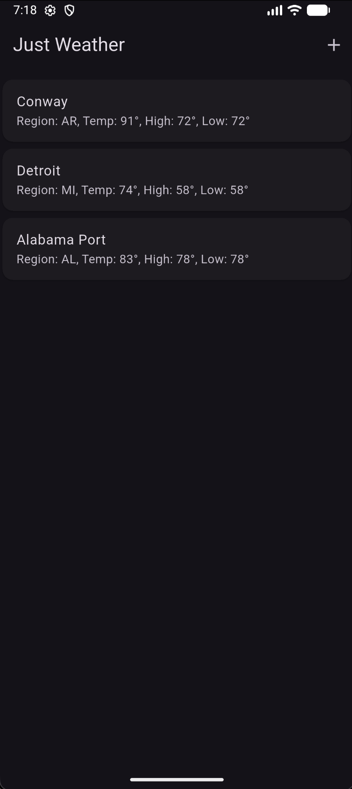
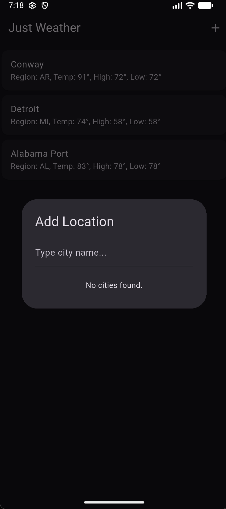
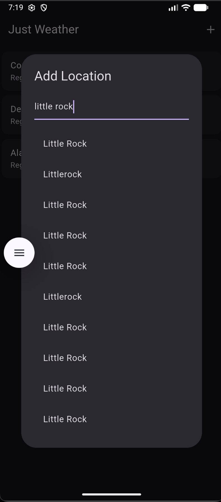
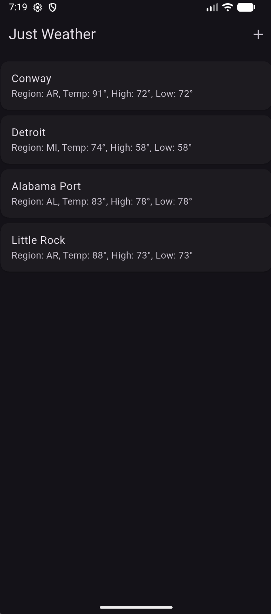
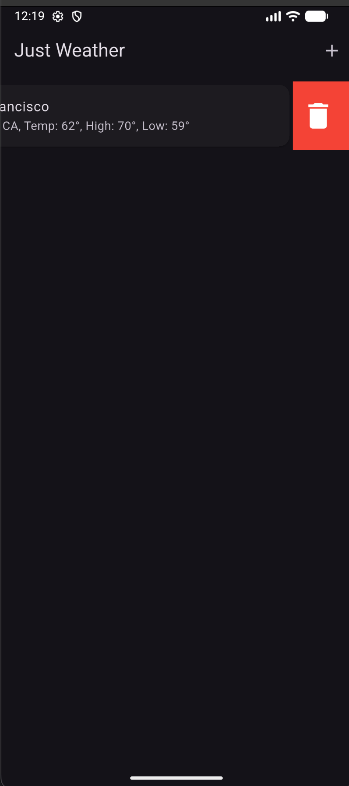

# Just Weather

A basic Weather App made in Dart, using National Weather Service API.

## Why?

I have always had an interest in making a weather app, especially since BlueSky was bought by Apple. I prefer something minimal that just tells me what the weather is rather than all the flashy visuals.

## Collaboration

Pull Requests and Issues are welcome. I don't know why there would be any, since this is a school project, but it is an option.

## Screenshots

## Credits

NWS API: (https://www.weather.gov/documentation/services-web-API)
Dart Docs: (https://dart.dev/docs)
Flutter Docs: (https://docs.flutter.dev/)